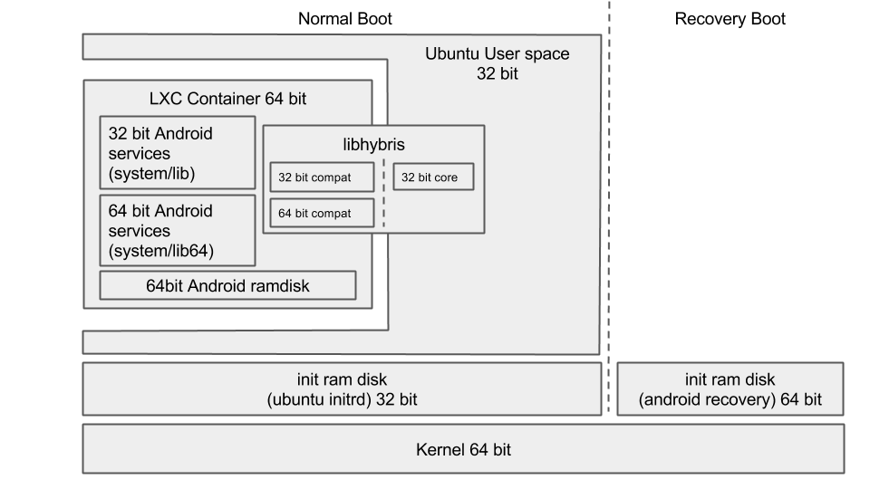

# CM

rebase on CyanogenMod

# Current architecture of ubuntu touch




# Preparation

- Get android/Cyanogenmod tree and setup devel env

https://wiki.cyanogenmod.org/w/Build_for_hammerhead

- Once initial build passes, flash $OUT/cm-....zip file with $OUT/recovery.img
- Verify CM works

------

# Modify kernel to support all the features

```
 CONFIG_CGROUP_DEVICE=y
 CONFIG_CPUSETS=y
 CONFIG_CGROUP_MEM_RES_CTLR=y
 CONFIG_CGROUP_PERF=y
 CONFIG_UTS_NS=y
 CONFIG_IPC_NS=y
 CONFIG_USER_NS=y
 CONFIG_PID_NS=y
 CONFIG_DEVPTS_MULTIPLE_INSTANCES=y
```

These are bare minimum to support containers, more can be required when we do further work

once patched kernel config,

```
$ breakfast hammerhead
including vendor/cm/vendorsetup.sh
Looking for dependencies

============================================
PLATFORM_VERSION_CODENAME=REL
PLATFORM_VERSION=5.1.1
CM_VERSION=
TARGET_PRODUCT=cm_hammerhead
TARGET_BUILD_VARIANT=userdebug
TARGET_BUILD_TYPE=release
TARGET_BUILD_APPS=
TARGET_ARCH=arm
TARGET_ARCH_VARIANT=armv7-a-neon
TARGET_CPU_VARIANT=krait
TARGET_2ND_ARCH=
TARGET_2ND_ARCH_VARIANT=
TARGET_2ND_CPU_VARIANT=
HOST_ARCH=x86_64
HOST_OS=linux
HOST_OS_EXTRA=Linux-4.5.0-1-ARCH-x86_64-with-glibc2.2.5
HOST_BUILD_TYPE=release
BUILD_ID=LMY49H
OUT_DIR=/home/bshah/android/out
============================================

$ mka bootimage

```

- Once done, flash $OUT/boot.img and verify if it works

# Stripping CM to bare minimum

- Android provides embedded.mk file to setup really minimal android system

https://android.googlesource.com/platform/build/+/master/target/product/embedded.mk

- Adapt make files in device/lge/hammerhead to extend this instead of full-fleged phone system

- And finally

```
$ brunch hammerhead
```

# Get lxc

https://jenkins.linuxcontainers.org/view/LXC/view/LXC%20builds/job/lxc-build-android/

deploy it to /data

TODO: figure out proper way..

# Create lxc container for pm rootfs

http://mobile.neon.pangea.pub:8080/job/img_phone_xenial_armhf/lastSuccessfulBuild/artifact/result/livecd..rootfs.tar.gz

- Create /data/lxc/containers/system/ dir
- Extract livecd..rootfs.tar.gz in /data/lxc/containers/system/rootfs/ dir

```
rm /data/lxc/containers/system/rootfs/etc/init/tty*.override
```

- Create lxc config

```
root@hammerhead:/ # cat /data/lxc/containers/system/config
lxc.rootfs = /data/lxc/containers/system/rootfs
lxc.utsname = armhf

lxc.network.type = none
lxc.mount.auto = cgroup

lxc.devttydir = lxc
lxc.tty = 4
lxc.pts = 1024
lxc.arch = armhf

lxc.kmsg = 0
lxc.mount.entry = /dev dev/ none bind,optional,create=dir
lxc.mount.entry = /system system/ none bind,optional,create=dir
```

- Mount systemd and freezer cgroups

```
mkdir /sys/fs/cgroup/systemd/
busybox mount -n -t cgroup -o none,name=systemd cgroup /sys/fs/cgroup/systemd/
mkdir /sys/fs/cgroup/freezer/
busybox mount -n -t cgroup -o none,name=freezer cgroup /sys/fs/cgroup/freezer/

ROOTFS=/data/lxc/containers/system/rootfs
for i in $(busybox awk '!/^#/ { if ($4 == 1) print $1 }' /proc/cgroups); do
    if ! grep -q " $ROOTFS/$i " /proc/mounts; then
        mkdir -p $ROOTFS/$i
        busybox mount -n -t cgroup -o $i cgroup $ROOTFS/$i
    fi
done

```

Then start container

```
export PATH=/data/lxc/lxc/bin:$PATH
export LD_LIBRARY_PATH=/data/lxc/lxc/lib:$LD_LIBRARY_PATH
root@hammerhead:/data/lxc/lxc # lxc-start -n system
root@hammerhead:/data/lxc/lxc # lxc-info -n system
Name:           system
State:          RUNNING
PID:            4851
Memory use:     3.29 MiB
root@hammerhead:/data/lxc/lxc # lxc-console -n system

Connected to tty 1
Type <Ctrl+a q> to exit the console, <Ctrl+a Ctrl+a> to enter Ctrl+a itself

Ubuntu Xenial Xerus (development branch) ubuntu-phablet tty1

ubuntu-phablet login: phablet
Last login: Fri Apr 30 09:16:34 UTC 1971 on lxc/tty1
Welcome to Ubuntu Xenial Xerus (development branch) (GNU/Linux 3.4.0-cyanogenmod-g15e5a99-dirty armv7l)

 * Documentation:  https://help.ubuntu.com/
To run a command as administrator (user "root"), use "sudo <command>".
See "man sudo_root" for details.

phablet@ubuntu-phablet:~$
```

TODO: document further
TODO: document milestones
